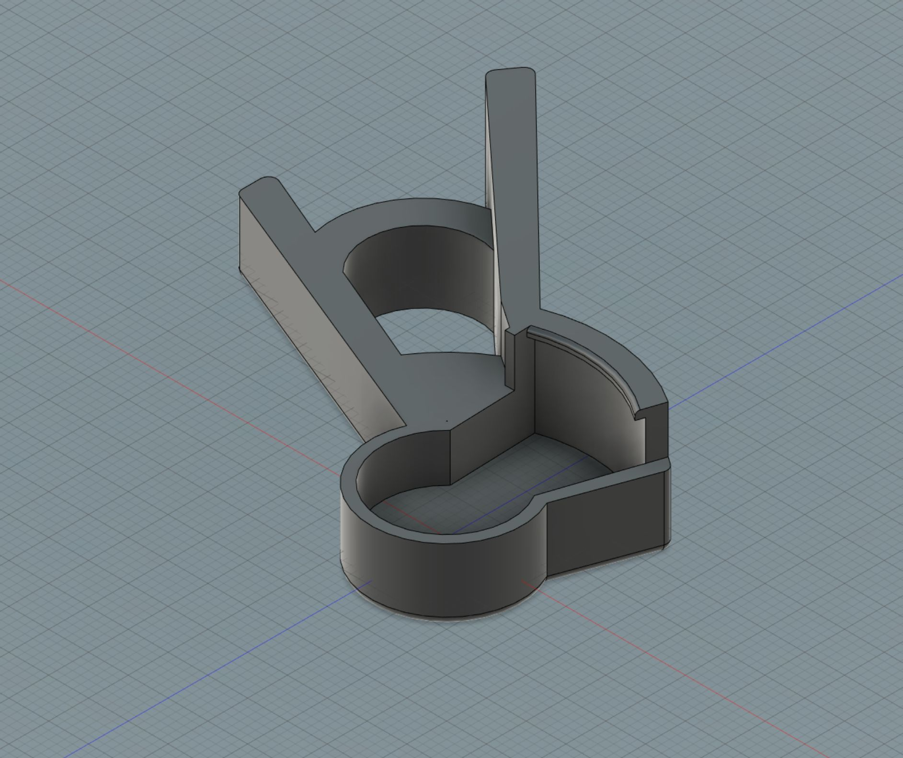
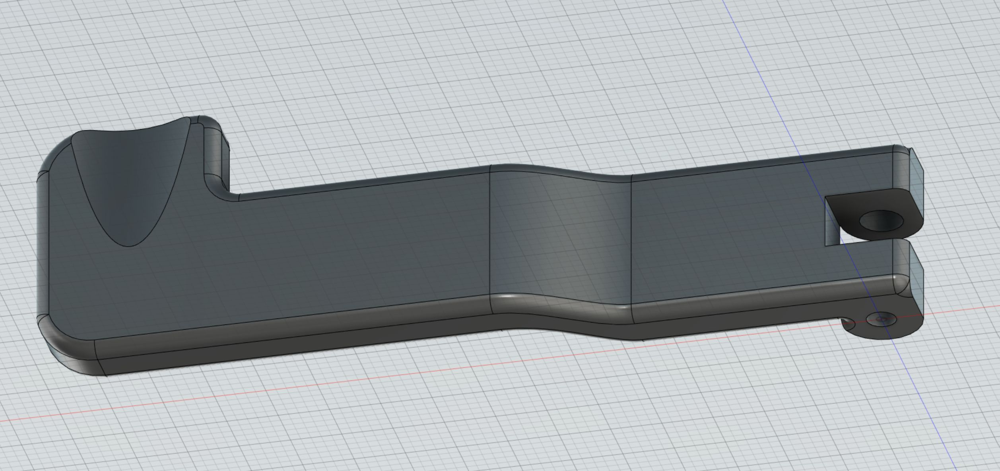

# Olympus PT-059 Housing Modifications

3d printer designs for modifications for the Olympus PT-059 underwater housing for the TG-6 camera.

## Zoom extender

Mounts over the existing zoom button and extends the control out so it is easy to use without taking your hand off of the tray handle. You need to use a dab of hot glue, bluetack or something similar to keep it in place.

## Shutter extender

Replaces the original shutter and extends the control out so it is easy to use without taking your hand off of the tray handle. To install just unscrew the existing shutter lever and replace with this one.

